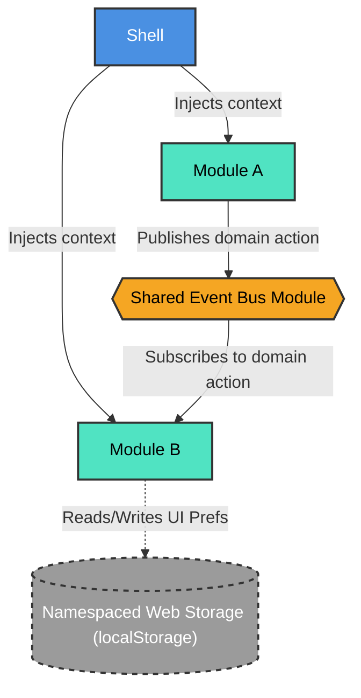

# MFE State Sharing and Communication

## 1. The Problem

**What's not working?**  
In a Micro Frontend (MFE) architecture, allowing frontends to communicate and share state without introducing tight coupling is a significant challenge. Traditional monolithic approaches like a single global Redux store create deployment dependencies and violate the core principles of micro-architecture.

**What's at stake?**  
Without a standardized, decoupled communication strategy, MFEs become tightly coupled, making independent deployments risky. A failure in one MFE could cascade and crash the entire application, and teams lose autonomy over their state management.

---

## 2. What We Decided

**The core approach:**  
We decided on a **Framework-Agnostic Singleton (Custom EventBus)** approach for cross-MFE messaging, enforcing decentralized state and local data ownership.

**Key changes:**
- **Event Bus (Messaging):** Apps (MFEs) communicate by sending messages (events) through a shared Event Bus, instead of calling each other directly.
- **Standardized Contracts:** All message formats are defined in one central place and versioned (e.g., `domain:action:v1`) to prevent breaking older apps.
- **Keep Global State Small:** We only share the bare minimum across apps (like Theme, Language, and User Login info).

**What stays the same:**  
Individual MFEs maintain their autonomy in local state management (e.g., fetching and storing their own data using tools like TanStack Query). The App Shell continues to orchestrate initial context injection.

---

## 2.1. Visual Overview

> *Diagrams to understand the architecture at a glance.*

### High-Level Flow / Components

---

## 3. Why This Approach

**Primary reasons:**
1. **Autonomy & Fault Tolerance:** MFEs maintain complete autonomy. If one app crashes while reading a message, it won't crash the rest of the page.
2. **Type-Safety:** Full TypeScript type-safety is maintained across MFE boundaries by standardizing contracts.
3. **Decoupling:** Eliminates tight coupling between MFEs, abstracting event listener boilerplate while preventing a distributed monolith.

---

## 4. Trade-offs

| Pros | Cons |
|-------|-------|
| MFEs maintain complete autonomy; no cascading failures. | Developers must be disciplined about not over-using the Event Bus. |
| Full TypeScript type-safety is maintained across MFE boundaries. | Payload serialization is required. |
| Highly decoupled; abstracts the event listener boilerplate. | State isn't strictly reactive across different frameworks out-of-the-box. |

---

## 5. What Needs to Change

**New components/modules to build:**
- Shared Event Bus Module (`CustomEvent` based Singleton).
- Shared Contracts module for centralized, versioned event payloads.

**Changes to existing systems:**
- Existing direct MFE-to-MFE function invocations must be refactored to use the Event Bus.
- App Shell needs to be restricted to only inject minimal context (Theme, Locale, User Identity).

**Team impact:**
- Teams must adopt the standardized event contract structure.
- Developers need to rely on local data fetching (e.g., TanStack Query refetching) instead of expecting real-time reactive global state updates.

---

## 6. Migration Plan

- **Phase 1:** Implement the shared Event Bus and define the initial set of standardized contracts.
- **Phase 2:** Update the App Shell to provide minimal context and migrate existing MFEs to use the Event Bus for cross-domain notifications.
- **Phase 3:** Remove any legacy direct MFE-to-MFE communication or shared global state dependencies.

**Rollback strategy:**  
If the Event Bus introduces unacceptable latency or debugging complexity, we can temporarily revert to direct module imports or a lightweight shared global state while maintaining versioned payload contracts.

---

## 7. Related Documents

- [Architecture Diagram](#21-visual-overview)

---

## 8. Alternative Methods Considered & Rejected

**Rejected: 1. Custom Events & Web APIs (Pub/Sub)**
- *Best for maintaining high isolation between autonomous MFEs. Micro-frontends do not share libraries; instead, they communicate by publishing and listening to native browser events on the window object.*
- **Use case:** Global notifications, user logins, or theme changes.
- **Pros:** Complete technological independence; no shared state libraries.
- **Cons:** Payload serialization is required; harder to track state mutations over time.

**Accepted: 2. Framework-Agnostic Singletons (Custom EventBus)**
- *(This was selected as our primary approach)* A singleton class or Pub/Sub object is exposed via a host application or a shared module. Individual MFEs import this bus to emit changes or subscribe to state updates.
- **Use case:** Managing shared state like user sessions or shopping carts without forcing a specific framework.
- **Pros:** Highly decoupled; abstracts the event listener boilerplate.
- **Cons:** State isn't strictly reactive across different frameworks out-of-the-box.

**Rejected: 3. Shared Global Store (e.g., Redux or Zustand)**
- *Best for MFEs built on the same framework (e.g., all React). A central store is typically initialized in the host application or packaged as a shared module via Module Federation.*
- **Use case:** Deeply interconnected applications that require a predictable, central source of truth.
- **Pros:** Familiar developer experience; allows cross-MFE state travel and debugging.
- **Cons:** Can create a "distributed monolith"; teams lose complete autonomy and must version-lock the state library.
