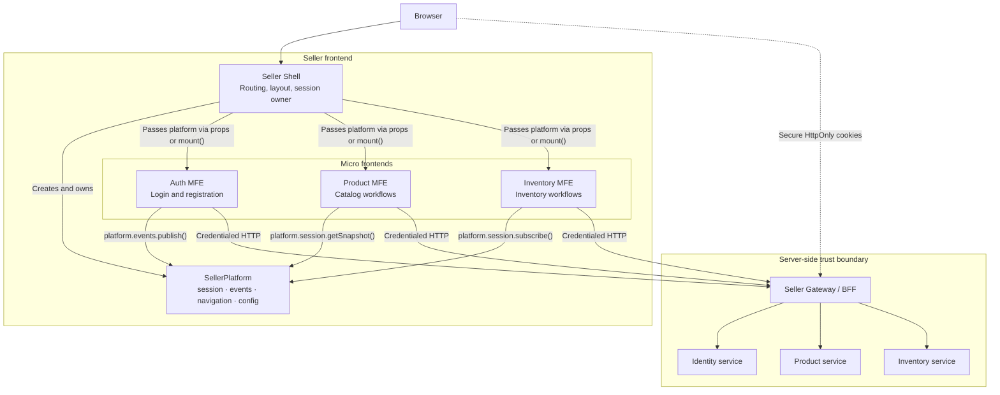
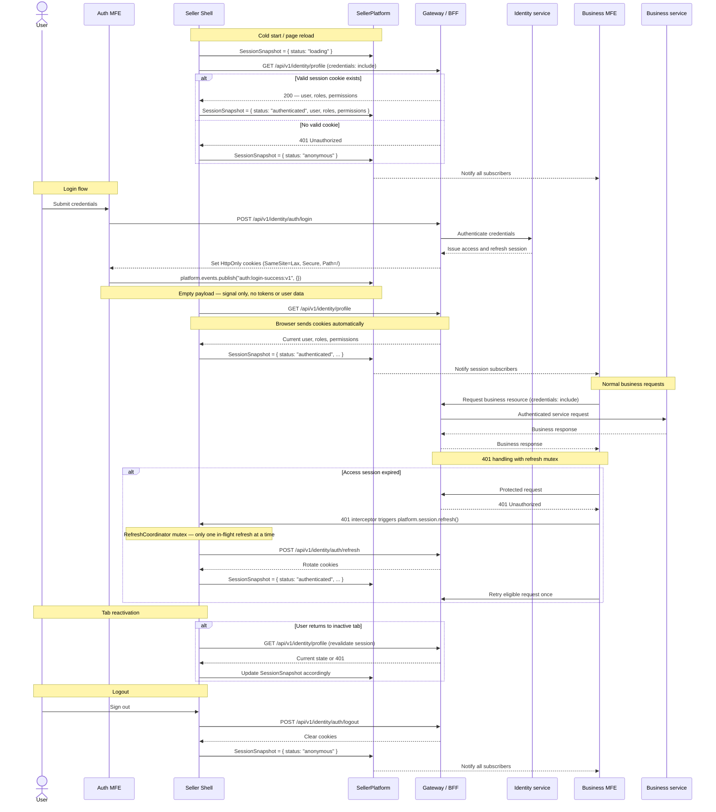

# Auth State Sharing for MFEs

## 1. The Problem

**What's not working?**  
The Seller Shell currently persists authentication data in browser-readable storage (`localStorage` for tokens and user objects), and MFEs do not yet have a stable, framework-neutral way to observe authentication state. This creates pressure to share tokens, React context, package singletons, or event payloads across independently deployed MFEs.

**What's at stake?**  
If authentication state is shared informally, any loaded MFE or XSS issue can increase credential exposure, and teams can accidentally couple their delivery to Shell internals. Without a clear contract, future React and non-React MFEs may implement incompatible authentication assumptions.

---

## 2. What We Decided

**The core approach:**  
The Seller Shell owns frontend session state and exposes it through a single, standardized `SellerPlatform` object — the universal integration surface ("USB port") that every MFE receives. Credentials remain server-managed in `HttpOnly` cookies and are never exposed to JavaScript.

**Key changes:**

- Define a `SellerPlatform` contract as the **single integration object** passed to every MFE. It bundles session, events, navigation, and runtime configuration into one standardized interface.
- Model `SessionSnapshot` as a **discriminated union state machine** with `loading`, `anonymous`, and `authenticated` states — no nullable fields, no token fields.
- Replace `grab-seller` localStorage token and user persistence with a **session bootstrap** from the authenticated backend session (`GET /api/v1/identity/profile`).
- Implement a **refresh coordinator with a mutex** so concurrent `401` responses from multiple MFEs trigger exactly one token rotation, not parallel conflicting rotations.
- Use **signal-only auth events** (empty payloads) to notify MFEs that session state changed, while `platform.session.getSnapshot()` remains the single source of truth.
- Keep API requests credentialed with `credentials: "include"` and **deprecate bearer-token injection** for frontend consumers.
- Apply **`SameSite=Lax`** cookies as the primary CSRF protection for same-origin deployments.
- Define a **`MfeLifecycle` mount contract** that supports both React Module Federation today and future Web Component or framework-agnostic mount adapters.
- Standardize shared package naming across the Shell and MFEs so contracts and runtime singletons resolve consistently.

**What stays the same:**  
MFEs remain independently deployable and keep ownership of their local UI state, server-state cache, HATEOAS discovery maps, and business workflows. Backend services remain authoritative for authentication, authorization, permissions, and business data.

---

## 2.1. Visual Overview

> *Diagrams to understand the architecture at a glance.*

### High-Level Flow / Components


### Authentication and Session Flow


---

## 2.2. Contract Definitions

> *The TypeScript interfaces that define the integration surface between Shell and MFEs.*

### SessionSnapshot (Discriminated Union State Machine)

```typescript
/**
 * A discriminated union representing exactly one session state.
 * MFEs switch on `status` — TypeScript enforces exhaustive handling.
 */
type SessionSnapshot =
  | { status: "loading" }
  | { status: "anonymous" }
  | {
      status: "authenticated";
      user: SessionUser;
      roles: readonly string[];
      permissions: readonly string[];
    };

type SessionUser = {
  id: string;
  email: string;
  name: string;
  avatar?: string;
};
```

**Why a discriminated union:** `switch (snapshot.status)` gives MFEs exhaustive, compiler-checked handling of every state. No `if (user !== null && !isLoading)` chains. No ambiguity between "still loading" and "logged out."

### SessionApi

```typescript
interface SessionApi {
  /** Current snapshot — never throws. */
  getSnapshot(): SessionSnapshot;

  /** Subscribe to state transitions. Returns an unsubscribe function. */
  subscribe(listener: (snapshot: SessionSnapshot) => void): () => void;

  /**
   * Request a session refresh. Shell-coordinated with a mutex —
   * concurrent calls piggyback on the same in-flight refresh.
   */
  refresh(): Promise<void>;

  /** Sign out and transition to anonymous state. */
  logout(): Promise<void>;
}
```

### SellerPlatform (The "USB Port")

```typescript
/**
 * The single integration object that every MFE receives.
 * Shell creates it, MFEs consume it read-only.
 * Works for React Module Federation today and mount() adapters tomorrow.
 */
interface SellerPlatform {
  readonly version: string;
  readonly session: SessionApi;
  readonly events: PlatformEvents;
  readonly navigation: PlatformNavigation;
  readonly config: Readonly<SellerRuntimeConfig>;
}

interface PlatformEvents {
  publish<K extends keyof EventPayloads>(
    type: K,
    payload: EventPayloads[K]
  ): void;
  subscribe<K extends keyof EventPayloads>(
    type: K,
    handler: (payload: EventPayloads[K]) => void
  ): () => void;
}

interface PlatformNavigation {
  navigate(path: string, options?: { replace?: boolean }): void;
}
```

**Why one object:** Instead of passing ad-hoc props to each MFE (`identityLink`, `onLogin`, `user`, etc.), every MFE receives the same `platform` object. New MFE? Just give it the platform. Done. This is the pattern used by single-spa (app props), Piral (Piral API), and Luigi Framework (context).

### Event Payloads (Signal-Only)

```typescript
/**
 * Auth events carry empty payloads — they are notifications, not data carriers.
 * MFEs always read actual state from platform.session.getSnapshot().
 * This prevents data duplication and state drift between events and session.
 */
type EventPayloads = {
  "auth:login-success:v1": Record<string, never>;
  "auth:logout:v1": Record<string, never>;
  "auth:session-refreshed:v1": Record<string, never>;
  "auth:session-expired:v1": Record<string, never>;
};
```

**Why signal-only:** If events carry `userId` and `role`, MFEs will cache that data from the event instead of reading `platform.session.getSnapshot()`. You end up with the same data in two places that can drift apart — the exact problem this ADR is solving.

### MFE Mount Lifecycle (Future-Proofing)

```typescript
/**
 * The mount contract for non-React MFEs (Web Components, Vue, Svelte, etc.).
 * React MFEs use RemoteBoundary today, but this contract sits underneath.
 */
interface MfeLifecycle<Props = Record<string, unknown>> {
  mount(container: HTMLElement, props: MfeMountProps & Props): MfeHandle;
}

interface MfeMountProps {
  platform: SellerPlatform;
  basePath: string;
}

interface MfeHandle {
  unmount(): void;
  update?(props: Partial<MfeMountProps>): void;
}
```

---

## 2.3. Key Implementation Details

### Refresh Coordinator (Mutex Pattern)

When a user's session cookie expires, multiple MFEs may receive `401` responses simultaneously. Without coordination, each MFE would trigger its own refresh request, causing concurrent cookie rotations where each rotation invalidates the previous one.

The Shell's `RefreshCoordinator` uses a mutex: the first `401` starts a refresh, and all subsequent callers wait and reuse the same result.

```
MFE-A → 401 → calls platform.session.refresh() → starts refresh → waits → ✅
MFE-B → 401 → calls platform.session.refresh() → sees in-flight → waits → ✅ (same result)
MFE-C → 401 → calls platform.session.refresh() → sees in-flight → waits → ✅ (same result)
```

One refresh, one cookie rotation, no conflicts.

### 401 Interceptor in the API Client

The shared API client (`seller-api`) intercepts `401` responses and coordinates with the Shell through `platform.session.refresh()` before retrying the failed request once. If the retry also fails, the session is treated as expired and the user is redirected to login.

### Session Bootstrap Sequence (Cold Start)

```
1. Shell renders skeleton UI → SessionSnapshot = { status: "loading" }
2. Shell calls GET /api/v1/identity/profile (credentials: include)
3. 200 → SessionSnapshot = { status: "authenticated", user, roles, permissions }
   401 → SessionSnapshot = { status: "anonymous" }
   Network error → Show offline banner, retry with exponential backoff
4. MFEs receive snapshot via subscribe() and render accordingly
```

### Tab Visibility Revalidation

When a user returns to an inactive browser tab, the Shell revalidates the session by calling the profile endpoint again. This prevents the "stale tab" problem where a user logs out in one tab but another tab still shows authenticated UI.

### CSRF Protection Policy

For same-origin deployments (Shell and gateway share the same domain), `SameSite=Lax` cookie attribute is the primary CSRF protection. This requires no frontend code — the browser refuses to send cookies on cross-origin state-changing requests. If future deployment requires cross-site traffic or `SameSite=None`, a synchronizer token (CSRF token) or double-submit cookie pattern must be added before that change.

---

## 3. Why This Approach

**Primary reasons:**
1. **Reduced credential exposure:** `HttpOnly` cookies keep raw access and refresh credentials unavailable to Shell and MFE JavaScript. No token fields exist in any contract or event payload.
2. **Single integration surface:** The `SellerPlatform` object is the only thing an MFE needs to integrate. It replaces ad-hoc props, shared React contexts, global singletons, and event bus imports with one standardized interface.
3. **Clear ownership:** The Shell owns application session state, while MFEs own their own UI state, data fetching, and cache invalidation. The discriminated union state machine makes ownership boundaries explicit at the type level.
4. **Framework independence:** `SellerPlatform` is a plain JavaScript interface. It works for React Module Federation today, `mount()`/`unmount()` adapters for Web Components tomorrow, and any future framework.
5. **Safe concurrent refresh:** The mutex pattern prevents the most common production bug in cookie-based MFE architectures: concurrent token rotations from parallel `401` responses.
6. **Independent deployment:** MFEs depend on versioned contracts (`@grab/seller-contracts`) rather than importing Shell internals or sharing mutable global stores.
7. **Backend authority:** Authorization remains enforced by backend services and HATEOAS capabilities, not frontend route checks.

---

## 4. Trade-offs

| Pros | Cons |
|-------|-------|
| Raw tokens are never exposed to frontend code, event payloads, or contracts. | Cookie-based auth requires correct gateway, domain, HTTPS, `SameSite`, and CSRF configuration. |
| `SellerPlatform` gives every MFE a single, uniform integration surface. | The platform contract must be versioned and maintained; breaking changes affect all MFEs. |
| Discriminated union `SessionSnapshot` gives MFEs exhaustive, compiler-checked state handling. | MFEs must handle all three states (`loading`, `anonymous`, `authenticated`), even if trivially. |
| Refresh mutex prevents concurrent token rotation conflicts. | Adds complexity to the Shell; the mutex must handle timeout, failure, and re-entrancy correctly. |
| Signal-only events keep one source of truth (`SessionSnapshot`). | MFEs must call `platform.session.getSnapshot()` after receiving an event, rather than using event data directly. |
| The same contract serves React and non-React MFEs. | Non-React MFEs need a mount adapter that wraps `SellerPlatform` into their framework's lifecycle. |
| MFEs keep local data ownership and cache boundaries. | Consumers may need to refetch data after session or domain events. |
| Tab visibility revalidation prevents stale sessions. | Adds an extra network request on each tab re-activation. |

---

## 5. What Needs to Change

**New components/modules to build:**
- `SessionSnapshot` discriminated union contract with `loading`, `authenticated`, and `anonymous` states; `SessionUser` with id, email, name, avatar; roles; and permissions. **No token fields.**
- `SessionApi` contract with `getSnapshot()`, `subscribe(listener)`, `refresh()`, and `logout()` methods.
- `SellerPlatform` contract that bundles `session`, versioned `events`, `navigation`, and read-only runtime `config` into one interface.
- `PlatformEvents` contract with typed `publish()` and `subscribe()` methods keyed to `EventPayloads`.
- `PlatformNavigation` contract with `navigate()` for Shell-coordinated routing.
- `MfeLifecycle`, `MfeMountProps`, and `MfeHandle` contracts for future non-React MFE mount adapters.
- Shell-owned session provider that bootstraps from `GET /api/v1/identity/profile`, coordinates refresh with a mutex, handles tab visibility revalidation, and manages logout cleanup.
- `RefreshCoordinator` class with mutex pattern that ensures only one refresh request is in-flight at a time.
- Signal-only event payloads: `auth:login-success:v1`, `auth:logout:v1`, `auth:session-refreshed:v1`, `auth:session-expired:v1` — all with empty payloads.
- Compatibility and contract tests (Zod schema validation) for session bootstrap, login notification, refresh coordination, logout, unauthorized responses, and MFE subscriptions.

**Changes to existing systems:**
- Replace `grab-seller/src/app/AuthContext.tsx` localStorage usage for `seller-access-token` and `seller-user` with the Shell session provider that reads from the `SessionSnapshot`.
- Remove the `token` field from `AuthState` in `@khinemyaezin/seller-contracts` — its presence contradicts the core decision.
- Update login and logout flows to rely on cookies set or cleared by backend auth endpoints.
- Update `RemoteBoundary` to pass the `SellerPlatform` object instead of ad-hoc remote props. Every MFE receives `{ platform: SellerPlatform }`.
- Add a 401 interceptor to `grab-seller-shared-ui/packages/seller-api/src/client.ts` that calls `platform.session.refresh()` and retries once.
- Deprecate `getAccessToken`, per-request `token` parameter, and `Authorization` header injection in `client.ts` for frontend use. Keep `credentials: "include"` only.
- Standardize shared package imports to one npm scope (`@grab/*` or `@khinemyaezin/*`) and update Module Federation `shared` config in all `vite.config.ts` files.
- Remove `userId` and `role` from auth event payloads — events become signals, `SessionSnapshot` is the single source of truth.
- Apply `SameSite=Lax` cookie attribute on all auth cookies at the gateway level.

**Team impact:**
- Frontend teams treat authentication as a read-only platform capability through `platform.session` and never handle raw tokens.
- MFE teams receive `SellerPlatform` and integrate through its APIs — no other integration surface is needed.
- MFE teams use local TanStack Query caches and HATEOAS links for business state rather than a global store.
- Platform owners maintain the `SellerPlatform` contract, event contract, package naming, and compatibility tests.
- Backend and platform teams jointly validate cookie attributes (`HttpOnly`, `Secure`, `SameSite=Lax`, `Path=/`), refresh behavior, logout behavior, CSRF posture, and gateway authentication translation.

---

## 6. Migration Plan

- **Phase 1 — Backend and contracts:**
  - Verify the backend cookie login, logout, refresh, and profile path through the Seller gateway.
  - Confirm cookie attributes: `HttpOnly`, `Secure`, `SameSite=Lax`, `Path=/`.
  - Define and publish `SessionSnapshot`, `SessionApi`, `SellerPlatform`, `PlatformEvents`, `PlatformNavigation`, and `MfeLifecycle` contracts in `@grab/seller-contracts`.
  - Remove `token` field from `AuthState`.
  - Make auth event payloads signal-only (empty).
  - Keep the current bearer-token response temporarily for rollback compatibility.

- **Phase 2 — Shell implementation:**
  - Implement Shell-owned session provider with `SessionSnapshot` state machine.
  - Implement `RefreshCoordinator` with mutex pattern.
  - Add tab visibility revalidation.
  - Create the `SellerPlatform` runtime instance in the Shell.
  - Update `RemoteBoundary` to pass `platform` instead of ad-hoc props.
  - Add 401 interceptor to `client.ts`.
  - Remove `localStorage` reads/writes for authentication state.
  - Pass the read-only `SellerPlatform` contract to the auth MFE.
  - Write contract tests with Zod schema validation.

- **Phase 3 — MFE migration and cleanup:**
  - Migrate product, inventory, and future MFEs to consume `SellerPlatform`.
  - Standardize all package names to one npm scope.
  - Update Module Federation `shared` config across all `vite.config.ts` files in a coordinated cut-over.
  - Remove frontend bearer-token injection, `getAccessToken`, and per-request token path from `client.ts`.
  - Remove compatibility token fields and bearer-token fallback flag.
  - Verify all MFEs work with cookie-only auth in production.

**Rollback strategy:**  
Keep the current bearer-token frontend path behind a short-lived deployment flag while the cookie session path is verified. If cookie delivery, gateway authentication, or refresh fails in production, roll the Shell back to the previous client behavior while preserving backend cookie issuance; remove the fallback after the cookie session path is stable.

---

## 7. Related Documents

- [ADR 001: MFE State Sharing and Communication](ADR-001_StateSharing&Communication.md)
